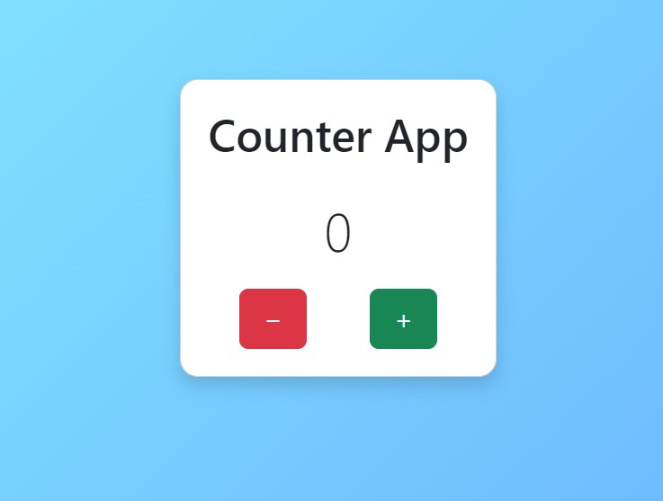
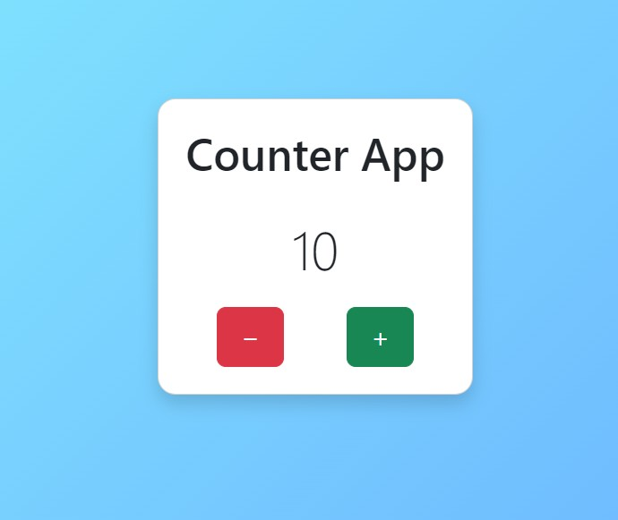

# 🌌 Counter App

Una semplice applicazione web che simula un contatore con pulsanti **+** e **−**, sviluppata in **JavaScript puro**.  
Lo scopo è esercitarsi con la **manipolazione del DOM**, l’uso di **SCSS** e la gestione del progetto in maniera professionale.

---

## ✨ Funzionalità

- Visualizzazione del valore del contatore (default `0`)
- Incremento con il pulsante **+**
- Decremento con il pulsante **−**, senza mai scendere sotto `0`
- Interfaccia generata dinamicamente con JavaScript
- Stile con **Bootstrap** + **SCSS** personalizzato
- Struttura modulare del codice (funzioni separate in moduli)
- Pronto per il deploy (Netlify / GitHub Pages)

---

## 📸 Screenshot

### Valore iniziale


### Valore incrementato


---

## 🛠️ Tecnologie utilizzate

- HTML5
- CSS3 + **SCSS**
- JavaScript (ES6 Modules)
- Bootstrap 5
- Git & GitHub

---

## 📂 Struttura progetto

```plaintext
counter-app/
│── index.html
│── assets/
│   ├── css/
│   │   └── style.css
│   ├── scss/
│   │   ├── style.scss
│   │   ├── _variables.scss
│   │   ├── _mixins.scss
│   │   ├── _base.scss
│   │   ├── _layout.scss
│   │   └── _components.scss
│   ├── js/
│   │   ├── script.js
│   │   └── modules/
│   │       └── counter.js
│   └── img/
│       ├── app_0.jpg
│       └── app_count.jpg
│── README.md
``` 

``` 

---

## 🚀 Deploy

Puoi provare l’app direttamente qui 👉 [Counter App Online](https://counter-app-cristiano-f0d0a.web.app)

---

## ⚙️ Installazione e utilizzo

1. Clona la repository:
   ```bash
   git clone https://github.com/CristianoDAlterio/counter-app.git
   ``` 

# counter-app
